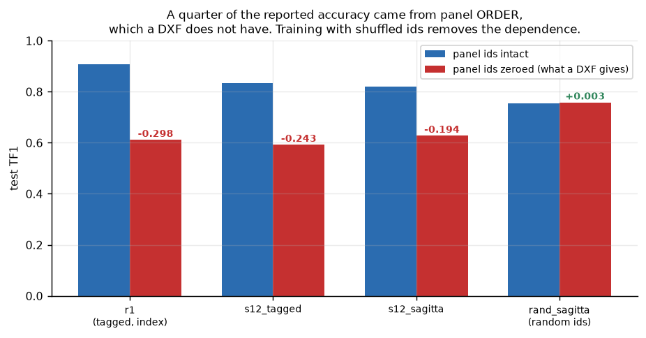
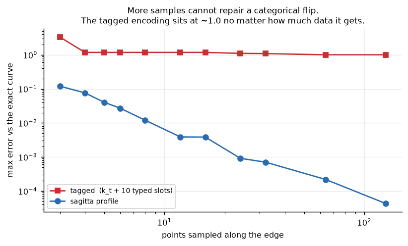
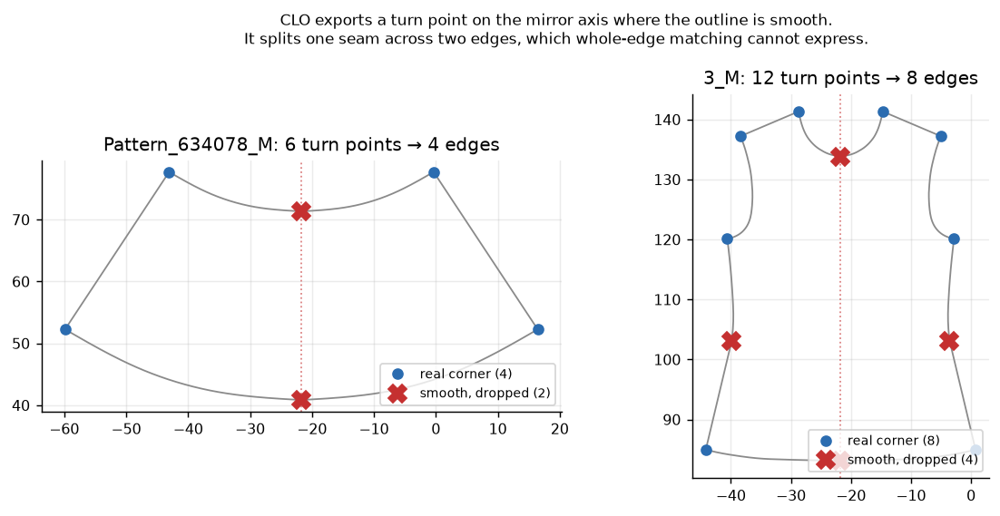
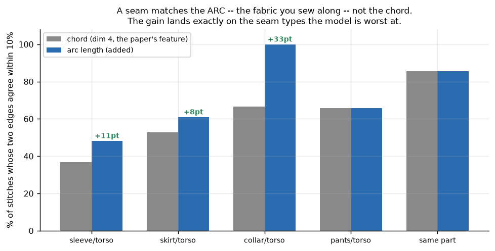
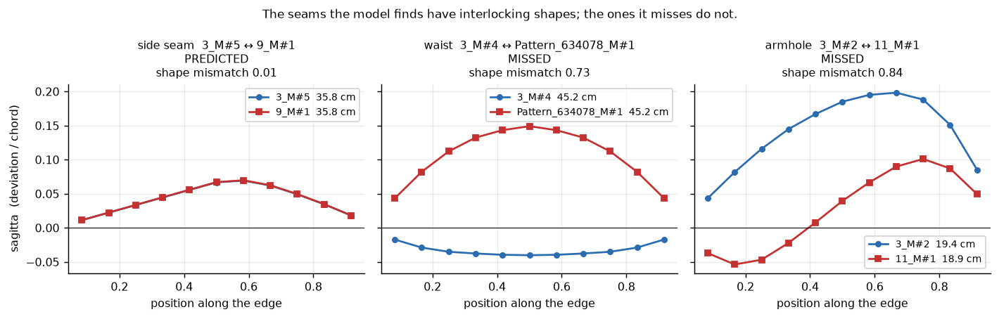
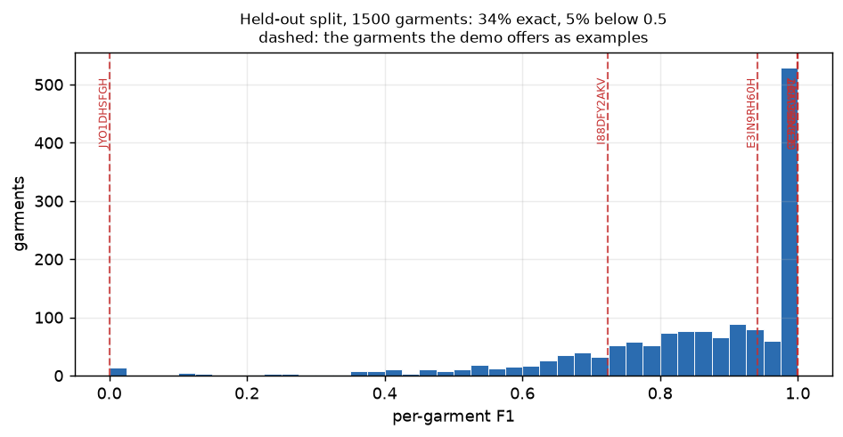

# Making an AutoSew reproduction work on real CLO exports

## 1. TL;DR

A reproduction of **AutoSew** (WACV 2026) — sewing pattern in, stitch correspondence out —
extended to take **real CLO exports** (DXF + FBX/OBJ) instead of only synthetic
GarmentCodeData. The reproduction reaches **TF1 0.9490** against the paper's 0.9706 on a
quarter of the data.

Getting it to work on a real garment is a separate problem. **It is not solved.** Four
concrete defects in how the input is represented were found and measured, three of them
fixed — and the model still scores **0.33–0.49 on a real CLO export against 0.75–0.95 on
the benchmark**. Worse, the ordering inverts: the model that scores best on
GarmentCodeData scores worst on the real garment, and adding 44x more training data made
real-world performance *drop*.

The findings below are each independently verified. The headline is the last one: **a
benchmark score on synthetic patterns did not predict performance on the thing it stands
in for.**

| # | blocker | cost | status |
|---|---|---|---|
| 1 | The model leaned on panel **ordering**, which a DXF has not got | **0.19–0.30 TF1** | fixed |
| 2 | Curvature features **cannot survive a DXF** — every curved edge fails to refit | DXF input impossible | fixed |
| 3 | CLO splits one seam across two edges on the **mirror axis** | one-to-many, inexpressible | fixed |
| 4 | Dim 4 is the **chord**; a seam matches the **arc** | 30pt on collar seams | fixed |
| 5 | Real seams join curves that **do not interlock** (armhole ↔ sleeve cap) | **0 of 8 ever found** | **open** |

The biggest one (#1) was invisible to any distribution check — the feature's *values* on
CLO data are perfectly in range; its *meaning* is destroyed.

---

## 2. Changes

| change | where | effect |
|---|---|---|
| `panel_id_mode="random_norm"` — shuffle panel ids during training | config | prediction becomes **order-independent**: ±0.004 TF1 under any perturbation, Jaccard **1.000** on CLO (was 0.39–0.62) |
| `curvature_encoding="sagitta"` — replace the type tag + 10 typed slots with 11 signed sagitta values | `autosew/curves.py` | round-trip error **1.101 → 7.7e-4**; CLO features land in-distribution on **all 24 dims** |
| Drop turn points where the boundary is smooth | `dxf_to_features.py`, `parseDxf.ts` | 60 → **48 edges**; the waist becomes **45.2 ↔ 45.2 cm**, an exact 1:1 |
| `arc_features` — append arc length and arc/chord | `features.py` | collar seams **66.7% → 100%** matched within 10% |
| Flip the arc sweep flag on reversed panels (**bug**) | `gcd_parser.py`, `parseSpec.ts` | ~3.5% of edges had one wrong boolean; **0.554 → 5.4e-9** |
| Derive seam ground truth from CLO's own weld | `export_weld_gt.py` | first scorable ground truth for a real garment |
| Browser demo takes DXF; ONNX exporter; 3D views | `webdemo/`, `scripts/export_onnx.py` | whole pipeline runs client-side |

---

## 3. Evidence

### 3.1 Panel ordering — a quarter of the accuracy was an artifact

GCD numbers panels in *generation* order, so related panels are adjacent. A DXF numbers
them by block order. Zeroing that feature: **r1 0.9086 → 0.6110**, GSP **0.445 → 0.085**.
Trained with shuffled ids instead, the model is unaffected by it (0.7552 → 0.7577).

Trade: −0.07 nominal on GCD, **+0.13 in the regime that matters**, and a deterministic
prediction.

### 3.2 Curvature — more samples cannot repair a categorical flip

The paper's dims 7–17 are a tagged union: `k_t` selects what the ten slots mean. A DXF has
no `k_t`, so it must be estimated — and on the real CLO file **all 28 curved edges fail to
fit**, by 10× to 600× tolerance, because a CLO boundary between corners is free-form.
(Our synthetic round trip never showed this: it emits single-Bézier edges, so its F1 of
0.783 was optimistic.)

Sagitta's error converges with sampling density; the tagged encoding **sits at ~1.0
forever**. Its value is not accuracy — with panel order removed the two encodings tie
(0.7501 vs 0.7468) — it is that **DXF input becomes possible at all**.

### 3.3 The mirror axis splits a seam in two

A piece CLO built by mirroring keeps a vertex on the mirror axis and exports it as a turn
point, though the outline is smooth through it. The two populations separate by **40°**:
the artifacts run straighter than 161°, the sharpest real corner turns to 120°. Twelve of
the garment's 60 turn points are artifacts, leaving **48 edges**.

It matters because the model matches *whole edges*. Before the fix the waist was two
bodice edges against one skirt edge — a one-to-many correspondence the output space cannot
express. After it, both sides are a single edge of **45.2 cm and 45.2 cm**. The neck and
the side seams merge the same way, and the two bodices become symmetric at 8 edges each.

### 3.4 A seam matches the arc, not the chord

| seam type | chord | arc |
|---|---|---|
| collar/torso | 66.7% | **100.0%** |
| sleeve/torso | 36.9% | **48.2%** |
| skirt/torso | 52.7% | **61.0%** |
| same part | 85.7% | 85.7% |

(% of stitches whose two edges agree within 10%.) The gain lands **only** on the seam types
the model is worst at.

### 3.5 The one that is still open: shapes that do not interlock

Hand-drawn ground truth for the CLO garment turns out to be extremely regular: **11 of its
20 stitches match in length to 1.000, and 18 of 20 to within 3%**. Length is not the
problem. Sorting those 20 stitches by how well the two edges' shapes interlock — the
residual after allowing a sign flip and a reversal, over the amplitude — splits them
cleanly, and so does the models' success:

| shape mismatch | stitches | found, over 4 models | rate |
|---|---|---|---|
| interlocking (< 0.05) | 12 | 29 of 48 | 0.60 |
| **unrelated (> 0.5)** | **8** | **0 of 32** | **0.00** |

**Not one model finds a single seam whose two edges are not geometric complements. Zero out
of thirty-two attempts.** And the eight are exactly the seams that make a garment a
garment:

| missed seam | length ratio | shape mismatch |
|---|---|---|
| waist × 2 | **1.000**, 1.003 | 0.73, 0.87 |
| armhole × 4 | 1.018, 1.028 | 0.74, 0.84 |
| strap to bodice × 2 | 1.190, 1.171 | 1.00, 1.00 |

Their lengths are near-perfect. What fails is that a concave armhole is eased onto a convex
sleeve cap, and a nearly straight bodice waist onto a flared skirt — the figure above shows
the waist pair at 45.2 cm against 45.2 cm with one edge flat and the other bowed 3.7× more.

Ruled out, with numbers: **not edge length** (the missed seams match to 1.000); **not
length ambiguity** (the model does *worst*, 0 of 4, on the seams with a unique length);
**not edge count** (GCD stitched panels share one 33.3% of the time against 29.3% at
random); **not a seam type it never saw** — on GCD its armhole recall is **0.993** and its
waist recall **0.830**.

That last one is the open question. In GarmentCodeData the model handles shape-mismatched
seams well; on a real garment it gets none of them. Whatever cue it uses there is absent
here, and I have not identified it.

> **Two methodological notes**, both of which cost real time.
>
> An earlier version of this section reported the same conclusion with wrong numbers —
> length ratios up to 3.4×, and a story about the garment being outside GCD's
> distribution. The diagnostic scripts read edges straight from the DXF while the pipeline
> canonicalises each panel to anticlockwise first, so on every reversed panel they named a
> different edge than the model was given. It surfaced because the ratios did not look
> like 3× on the drawing. The fix was to give the analysis and the pipeline one shared
> accessor (`dxf_to_features.panel_edges`) instead of two implementations of one ordering.
>
> And an earlier draft cited the two waistband straps as evidence that the model cannot
> tell the four edges of a thin rectangle apart: it paired them transposed against the
> ground truth, and all four models agreed on the same transposition. The ground truth was
> wrong. Four independent models agreeing is evidence *for* an answer, not against it —
> the agreement should have prompted a check of the label rather than an explanation of
> the error.

### 3.6 Ground truth, validated by CLO itself

Exporting the garment twice — weld off and on — makes CLO's weld the answer: 44,696 →
44,455 vertices = **241 merges**, and clustering unwelded panels by bit-exact position
reproduces **exactly 241**. That equality is the export gate.

Real seams, not drape contact: welded pairs are at distance 0, the nearest *non*-welded
cross-panel pair is **10.98 mm**, nothing in between.

---

## 4. Results

| run | garments | encoding | panel ids | test TF1 | GSP |
|---|---|---|---|---|---|
| paper | 102,660 | tagged | index | 0.9706 | 0.806 |
| r1 | 24,024 | tagged | index | 0.9490 | 0.7203 |
| rand_sagitta | 2,000 | sagitta | random | 0.7501 | 0.105 |
| r2 | 87,697 | sagitta | random | 0.8030 | 0.387 |
| **r3 (+ arc) — shipped** | **99,666** | sagitta | random | **0.8040** | 0.374 |

**r2's 0.8030 is not comparable to r1's 0.9490.** r1 quotes a number that includes the
panel-order signal and drops to **0.61** without it; r2 does not use that signal at all.

### And none of it transfers

Ground truth for the CLO garment was drawn by hand in the demo — 20 stitches over 40 of
its 48 edges — so the same models can finally be scored on a real industrial export, edge
by edge, the same way GCD is:

| model | GCD TF1 | **CLO TF1** | TP | TR |
|---|---|---|---|---|
| r1 — tagged, index ids, 24k | 0.9490 | 0.467 | 0.700 | 0.350 |
| s12_sagitta — index ids, 2k | 0.8191 | 0.471 | 0.571 | 0.400 |
| **rand_sagitta — random ids, 2k** | 0.7501 | **0.485** | 0.615 | 0.400 |
| **r2 — random ids, 87.7k** | **0.8030** | **0.333** | 0.375 | 0.300 |
| **r3 — + arc, 99.7k (shipped)** | **0.8040** | 0.471 | 0.571 | 0.400 |

(CLO scored one-to-one; see below. No model reconstructs the garment: GSP is 0 for all.)

An averaged TF1 hides the shape of the result, so here is the per-garment distribution on
1,500 held-out GarmentCodeData garments, scored with the model the demo ships:

| | |
|---|---|
| mean / median | 0.846 / 0.904 |
| exactly 1.000 | **34.1%** |
| above 0.9 | 50.3% |
| below 0.5 | **5.4%** |
| exactly 0.000 | 0.9% |

It is mostly-perfect with a real tail, not uniformly mediocre. The demo offers five of
these as examples, at the 0th, 19th, 59th and 66th percentiles — a spread, not a
highlight reel.

Three things this says, none of them comfortable:

1. **Every model roughly halves on real data.** 0.33–0.49 against 0.75–0.95 on GCD. The
   best finds 8 of the garment's 20 stitches.
2. **The two scores are not ordered together.** GCD spans 0.75–0.80 across these
   models while CLO spans 0.33–0.49, and the rank does not carry: the best model on the
   benchmark (r2, 0.8030) is the worst on the garment (0.333), and the model trained on
   2,000 garments (rand_sagitta, 0.7501) is still the best on it (0.485). **The
   benchmark does not predict the thing it is a proxy for.**
3. **More GarmentCodeData did not help, and once actively hurt.** r2 saw 44× the data
   of rand_sagitta and fell to 0.333. Arc features recovered that (r3, 0.471) without
   moving GCD at all — 0.8030 → 0.8040 — but 2,000 garments still edge out 99,666. That
   is domain overfitting, not sample overfitting: more exposure sharpens the fit to
   regularities a real pattern does not share. Panel ordering was one such regularity
   and is fixed; this says others remain unidentified.

### One-to-one is worth enforcing

The paper's inference rule takes each row's best partner *and* every partner scoring above
τ, then unions the unordered pairs — that is how a multi-edge stitch gets expressed. But
the training data contains **no multi-edge stitches at all** (`has_multi_edge_gt` is false
in every run, MEP/MER/MEF1 all 0), so the model never learned when to use it. On a real
garment the extra pairs are the model hedging, and every one is a false positive.

Keeping only pairs both edges name — a matching, so no edge can land in two stitches —
never lowered F1 and raised it for two of the five checkpoints:

| model | union | mutual |
|---|---|---|
| s12_sagitta | 0.432 | **0.471** |
| rand_sagitta | 0.471 | **0.485** |
| r1, r2, r3 | unchanged | unchanged |

This is right *for this garment*, which was cut so every seam is one-to-one. A pattern with
gathers has genuine one-to-many seams and mutual makes them inexpressible.

An earlier draft of this report claimed r2's 0.8030 "holds on DXF input". That was wrong.
The evidence behind it was the perturbation experiment, which shows only that r2 ignores
panel order — not that it transfers. Measured directly, it does not.

**Caveat on the CLO example.** Its panels were deliberately cut so that every seam is
one-to-one, because the model's output space is one-to-one edge pairs and the training
data contains no multi-edge stitches at all (`has_multi_edge_gt: false`, MEP/MER/MEF1 = 0
in every run). Real industrial patterns do contain one-to-many seams — one long skirt edge
gathered into two bodice edges — and nothing here demonstrates handling them. That is a
prepared input, not a solved case.

Verified: ONNX == PyTorch on **40/40** garments · browser features == training features to
**0.000e+00** · WASM solver matches the Python reference to **9.95e-11 cm** · seam GT
reproduces CLO's own merge count exactly.

## 5. Still open

No shared identifier exists anywhere between the 10 DXF pieces and the 10 draped panels —
not in DXF labels, not in any of the three FBX files, not in OBJ materials. Shape
invariants resolve the size *groups* but **cannot** separate a left sleeve from a right one
(identical perimeter and area by construction; assignment margins 0.0000) — the paper's own
"geometrically identical panels" limitation, one level up. Until that is broken, the CLO
prediction is scorable by group but not edge by edge.
